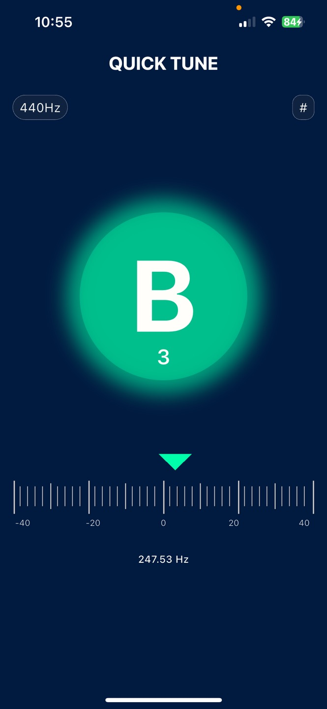

# QUICK TUNE | Simple & Precise Tuner for Everyone (IOS APP)

### 🎶 Just Play. We'll Tune.

**Quick Tune** helps you tune your instrument accurately — anytime, anywhere. Fast, intuitive, and beautiful. Perfect for beginners and pros alike.

👉 [Download on the App Store](https://apps.apple.com/app/6746946612)

### 🔍 What is Quick Tune?

**Quick Tune** is a simple yet powerful tuning app designed for musicians of all levels.

Whether you're playing guitar, violin, ukulele, or any other instrument, Quick Tune helps you get in perfect pitch — fast and easy.

| Feature | Description |
| --- | --- |
| 🎯 **Accurate Pitch Detection** | Detects your instrument's pitch in real-time and shows the exact note. |
| ⚙️ **Adjustable Tuning Frequency**  | Set your tuning reference from 438Hz to 444Hz — ideal for orchestral use. |
| 🎼 **Chromatic Tuning** | Works with any instrument or musical scale. |
| ♯/♭ **Enharmonic Switching** | Easily switch between sharp (#) and flat (♭) notation based on your preference. |
| 📊 **Visual Bar & Arrow Indicator** | See how close you are to the correct pitch with a dynamic tuning guide. |
| 🎨 **Clean, Minimal Design** | Intuitive interface for smooth, distraction-free tuning. |
| 📱 **Lightweight & Efficient** | Fast to launch, low battery usage, mic-based sound capture. |

### 🌈 Screenshots

Quick Tune is built with musicians in mind — especially those who value clarity, precision, and simplicity.

Created by a developer who is also a music learner 🎸.
